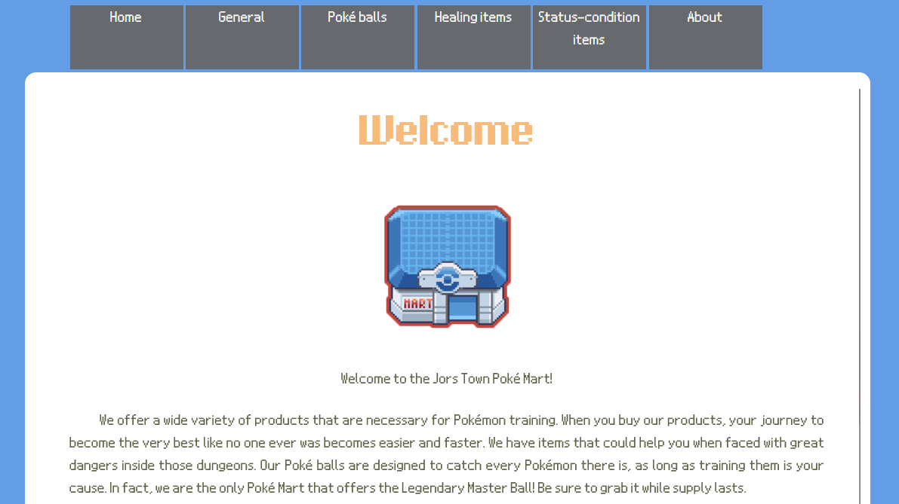
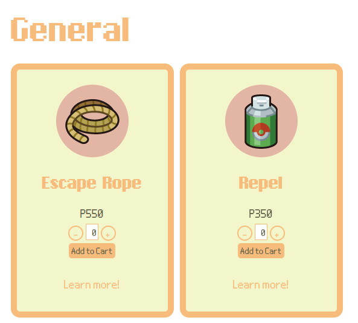
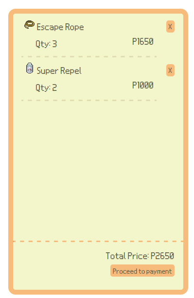
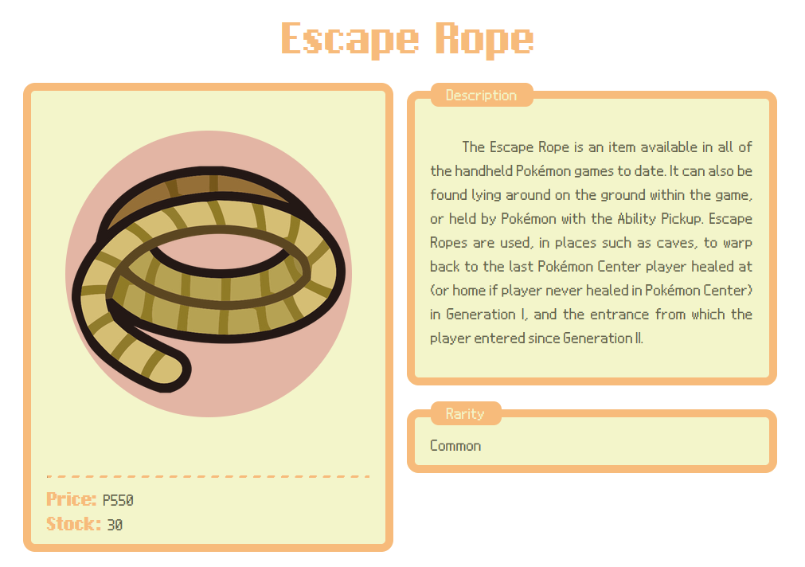

# PokéMart
## Overview
PokéMart is a simple online shop implementation using JSP.

## Prerequisites
* [Java Development Kit 6](https://github.com/alexkasko/openjdk-unofficial-builds?tab=readme-ov-file#previous-downloads)

* [Apache Tomcat 7](https://archive.apache.org/dist/tomcat/tomcat-7/v7.0.99/bin/)

## Checking dependencies
Check if `javac` is installed.
```bash
javac -version
```

It should show the JDK version you installed earlier.
```bash
javac 1.6.0-unofficial
```

Check if `jar` is installed.
```bash
jar -v
```

It should show the options accepted by `jar`.
```bash
One of options -{ctxu} must be specified.
Usage: jar {ctxui}[vfm0Me] [jar-file] [manifest-file] [entry-point] [-C dir] files ...

...
```

Check if Tomcat 7 is running properly.
```bash
curl localhost:8080 -i
```

It should return a 200 OK status.
```bash
HTTP/1.1 200 OK
Server: Apache-Coyote/1.1
Content-Type: text/html;charset=UTF-8
Transfer-Encoding: chunked
Date: Fri, 29 Aug 2025 14:44:16 GMT
```

## Running the Project
1. Clone this project locally.

2. Get the path to `servlet-api.jar`. It should be inside `lib/` of your Tomcat 7 installation folder.
    ```bash
    $SERVLET_API_PATH = "/path/to/tomcat7/lib/servlet-api.jar"
    ```

3. Compile the .java files. This generates .class files inside `WEB-INF/classes`.
    ```bash
    mkdir src/WEB-INF/classes
    javac -cp $SERVLET_API_PATH -d src/WEB-INF/classes src/WEB-INF/src/mart/*.java
    ```
4. Create a .war file.
    ```bash
    jar -cvf PokeMart.war -C src .
    ```

5. Copy the generated .war file inside `webapps/` of your Tomcat 7 installation folder.

    ```bash
    cp PokeMart.war /path/to/tomcat7/webapps
    ```

6. Wait for a few seconds for Tomcat 7 to extract your .war file. Open http://localhost:8080/PokeMart/mart.

The webpage should look something like this.



## Usage

Navigate the web page by clicking on the tabs above. Each tab shows different items depending on the item category selected.



The right side displays all items in the cart, showing the cumulative price for each item and the grand total price for the entire cart.



To add an item to the cart, press the `+` button on the item card.  Once the desired item count is reached, click the `Add to Cart` button.


Each item has a limited stock. Once the stock is depleted, you won't be able to add more of that item to your cart.

You can also click `Learn more!` to get a detailed view about the item.



